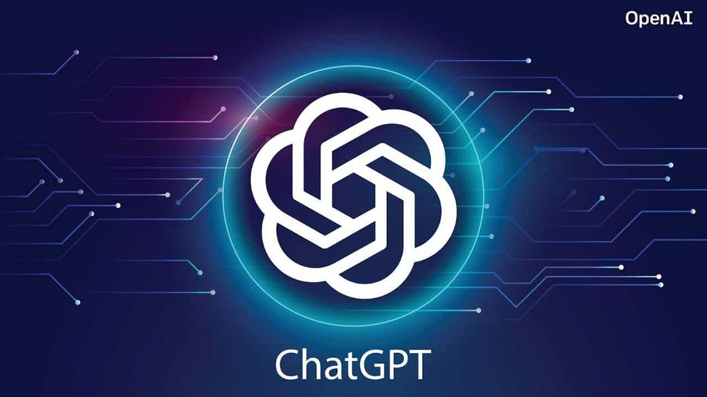

Software Engineering has grown to unbelievable heights since the dawn of AI. It has be highly impactful in terms of education and helped with the understanding of principles and applications of SWE. 

## I. Introduction
AI within education has been considered to be cutting corners to getting answers. However, I believe that it is a similar concept to the advancement in technology of books to the internet. Technology changes and methods evolve and we can only learn from AI. As far as Software Engineering and coding, it allows a personalized problem solving method to fixing your broken code. It is meant to help you do all of these things, however, if you are not asking the right questions or you don't have your own knowledge of the subject it can lead you down paths that will cost you more time. I used ChatGPT once or twice for ICS 314 when trying to figure out syntax for some JavaScript functions. I also used Co-Pilot and it was very helpful in helping me complete code that I would have written anyways. 

## II. Personal Experience with AI

### 1. Experience WODs
In the learning to do the WODs I would typically just follow the instructions and go through the material and try to solve using the video provided and the instructions. I would steer away from AI because these assignments were shorter and it would have taken longer to get ChatGPT up to speed.

### 2. In-class Practice WODs
I would use ChatGPT to help with packages/imports that I was not familar with such as Underscore.js. Since this library was unfamilar to me, I used it to understand functions as well as help me use those functions to solve the problem. 

### 3. In-class WODs
Similarly to the Practice WODs I would usually just use them for unfamiliar syntax or functions from libraries that I did not know. 

### 4. Essays
I thought it would be important to write essays on my own. 

### 5. Final Project
I would use the Co-Pilot to complete code and it would use AI to suggest code and it would 80% of the time be the code that I was about to write. 

### 6. Learning concept / tutorial
I thought it would be important to follow the instructions on the website and use those materials rather than use AI.

### 7. Answering a question in class or in Discord
I thought it would be important to answer questions on my own.

### 8. Asking or answering smart-questions
I would just ask peers if I had a question in person and I would not really answer questions on smart-questions.

### 9. Coding example
I would normally use ChatGPT for this type of course elements where I would need to get an example or how to use a certain function that I don't know how to use entirely. 

### 10. Explaining Code
I would use this feature sometimes with ChatGPT to explain what each of the Publications/MongoDB were doing to help me better understand how to use it in the future. 

### 11. Writing Code
The only writing code that I would use was in Github Co-Pilot when it could auto complete code using AI based on your code and code in the library. 

### 12. Documenting Code
I thought it would be important to write my own documentation so that I can understand my code. 

### 13. Quality Assurance
I would use this to fix bugs or the code was not working the way that I wanted it to work. I would use ChatGPT to help me with this by asking it what to do and telling it what was happening with the code and provide it with the code.

## III. Impact on Learning and Understanding
I think that the most impactful thing about ChatGPT is the ability to learn topics such as the imports and libraries that you are not familiar with. I think that this tool can be seen as both helpful and hurtful depending on how you ask your questions. It can help if you know some knowledge and you can ask correct and specific questions and it can be hurtful if you ask general questions and you don't know how you would be able to know if its right or wrong. 

## IV. Practical Application
Outside of education, I would use ChatGPT for helping me with personal projects that I would want to put on my resume. I wanted to create a .ASP NET core application and I had no knowledge of the subject, however, after some time of using it to create the application I was able to understand the framework and work with it without ChatGPT. I was also able to use it for coding when interning for software quality assurance as well as front-end software engineering and I would use it to solve bugs or incorrect outputs. 

## Challenges and Opportunities
I do know that AI such as ChatGPT have been known to hallucinate since the information that it has been given by so many people has overloaded and it cannot know all that is right and wrong. I have noticed these forms of hallucination because I would ask it a question and it would give me an answer that I did not think was right and I would tell it that it is wrong because of the reason and it would correct itself. If you did not know to think the answer is wrong, you can be lead astray.

## Comparitive Analysis 
I believe that the new era of teaching with AI and the ability to use these tools in order to solve problems is key to the advancement of technology. I have worked with different companies and I got to see the impact that ChatGPT and other AI tools have provided for people to understand the build new things they did not think they would be able to do. If education banned use of AI, especially in SWE, it would diminish their ability to use these resources in the future. 

## Future Considerations
AI in Software Engineering has remade what we thought was possible. Before, we had autocomplete that was very good at importing libraries and making sure we had the correct file path as such, however, now we have AI generated tools that can allow people to code these things based on the code they already have as well as AI predicted code. While currently there is a need for SWE to build these applications, I can see it the future these jobs will slowly diminish as the power of AI grows. 

## Conclusion
In conclusion, I believe that this course it taking advancements in technology and incorporating it into its course very well. The ability to use these tools and be able to learn how to use these tools is a great strength in the workplace. Since we are students, being able to use powerful tools such as Co-Pilot for free and having it integrated into our IDE makes learning how to use these tools very easy. 
